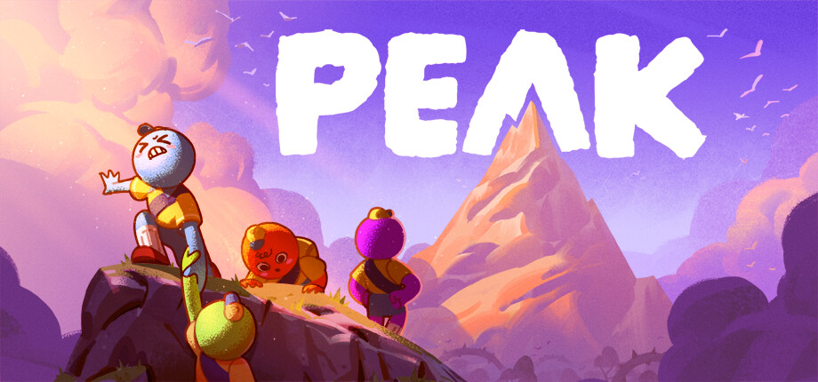

  <h1>PEAK Project Patcher</h1>

  

    A game wrapper that generates a Unity project from PEAK's build <strike>that can be playable in-editor</strike> <-- Sadly not yet.
  

# Table of Contents

- [About the Project](#about-the-project)
- [Current Limitations](#current-limitations)
- [Getting Started](#getting-started)
- [Installation](#installation)
- [Usage](#usage)
- [FAQ](#faq)

## About the Project

This tool is a game wrapper on top of the [Unity Project Patcher Fork](https://github.com/Jettcodey/unity-project-patcher) by Jettcodey.

This wrapper allows you to rip a build of PEAK with all its extracted assets/scripts/etc to then generatee a project for usage in the Unity editor.

> [!IMPORTANT]  
> This tool does not distribute game files. It simply works off of your copy of the game!
>
> Also, this tool is for **personal** use only. Do not re-distrubute game files to others.

## Current Limitations

This is also kinda the TODO's

- In-Editor Play Mode is currently not working.
- Some ScriptableObjects, scenes, and prefabs have missing references to scripts, objects, or other assets.
- None of the ripped shaders are working and no shader replacements are available.
- URP_Renderer asset is missing Renderer Features

## Getting Started

Make sure you have the following before using the tool in any way:

- [Git](https://git-scm.com/download/win)
- [.NET 10.0](https://dotnet.microsoft.com/en-us/download/dotnet/10.0)
  - To run Asset Ripper

Make a copy of your PEAK Game installation folder somewhere else on your Hard Drive. In that copy of the Game you need to go into the `PEAK\PEAK_Data\` directory and delete the following:

- All files named `level7` up to `level25`
- All files named `sharedassets7.assets` up to `sharedassets25.assets`

**If you skip this step the Patching Proccess will take up to 10 Hours!**

## Installation

### Unity Project

- Requires [Unity 6000.0.62f1](https://unity.com/releases/editor/whats-new/6000.0.62f1) or [Unity 6000.0.67f1](https://unity.com/releases/editor/whats-new/6000.0.67f1)
- Unity Universal Render Pipeline (URP)

Create a new Unity project with the above requirements before getting started.

You will need to install three packages in sequence here:

- Unity Project Patcher Fork by Jettcodey: `https://github.com/Jettcodey/unity-project-patcher.git`
- Unity Project Patcher BepInEx Fork by Jettcodey: `https://github.com/Jettcodey/unity-project-patcher-bepinex.git`
  - [Can be disabled](#disabling-bepinex-usage)
- This Project Patcher Wrapper: `https://github.com/Jettcodey/unity-peak-project-patcher.git`

### Installing the Unity Project Patcher core

1. Open the Package Manager from `Window > Package Manager`
2. Click the '+' button in the top-left of the window
3. Click 'Add package from git URL'
4. Provide the URL of the this git repository: `https://github.com/Jettcodey/unity-project-patcher.git`
5. Click the 'add' button

### Installing this Game Wrapper

The same steps as previously, just with `https://github.com/Jettcodey/unity-peak-project-patcher.git`

### Installing the BepInEx Wrapper

Open the tool window `Tools > Unity Project Patcher > Open Window` and press the `Install BepInEx` button.

Otherwise, follow the steps at https://github.com/Jettcodey/unity-project-patcher-bepinex

#### Disabling BepInEx Usage

If you don't want to use plugins, then follow the steps at https://github.com/Jettcodey/unity-project-patcher-bepinex#disabling-this-package

## Usage

The tool window can be opened via `Tools > Unity Project Patcher > Open Window` then simply click on `Run Patcher` at the Top of the window to begin patching the project.

Estimated patch durations:

- Fresh patch: **45 minutes to 1 hour** 
  > Up to 10 hours if you didnt delete the necessary files mentioned [here](#getting-started)
- Already patched: Unknown (Not Tested)

These can vary wildly depending on system speed and project size.

> [!NOTE]
> This process **WILL** take a while and will restart the Unity Editor about 5-6 times.
> At the very beginning, you will receive 4 Popups. You can safely click **OK** on each of them.\
> After some steps finished you'll get the 5th Popup `Script Updating Consent`, cick on **`Yes, for these and other files that might be found later`** for the patching process to continue.\
> After the Editor restarts for the final time, a confirmation Popup will appear indicating the project has been successfully patched. Click OK.

## FAQ

**Q: How do I get rid of the "No cameras rendering" warning?**

Right click the `Game` window and uncheck the checkbox labeled "Warn if no cameras rendering";

For more questions, see core project's FAQ: https://github.com/Jettcodey/unity-project-patcher#faq

## Credits

Initial Unity Peak Project Patcher development by [Jettcodey](https://github.com/Jettcodey)

The **`Unity PEAK Project Patcher`** would not have been possible without the prior work on the [R.E.P.O. Project Patcher](https://github.com/ZehsTeam/unity-repo-project-patcher) by [Kesomannen](https://github.com/Kesomannen/) and [ZehsTeam](https://github.com/ZehsTeam), which was used as a template, along with the inclusion of the [GeneratePhotonAssembliesStep.cs](https://github.com/ZehsTeam/unity-repo-project-patcher/blob/master/Editor/GeneratePhotonAssembliesStep.cs) file for this Unity Project Patcher wrapper.

Also a Huge thanks to all the Members of the [PEAK Modding Discord Server](https://discord.gg/SAw86z24rB). All the previously documented findings and guides for ripping the game assets were a very useful resource while developing this Unity Project Patcher wrapper.
